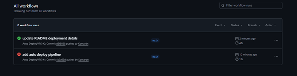
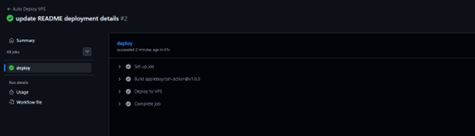
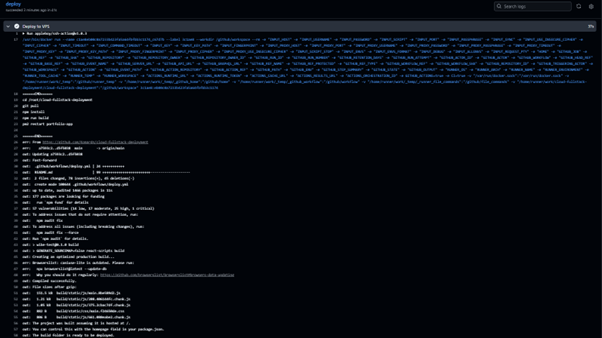
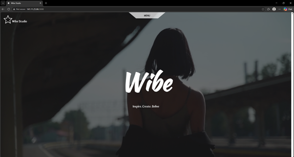
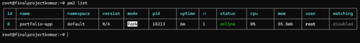
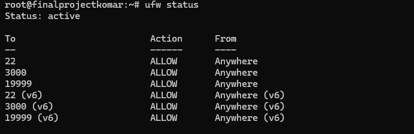
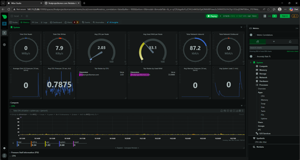
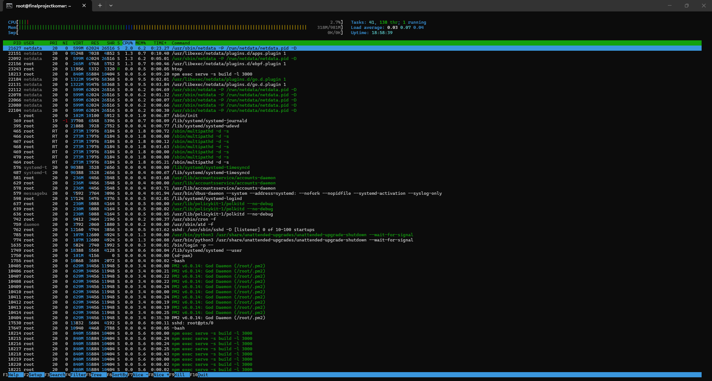
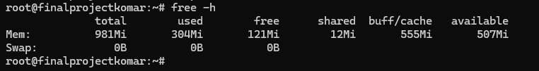

# 🚀 Cloud Full-Stack Deployment with CI/CD, Security & Monitoring

## 📌 Project Overview

This project demonstrates an end-to-end deployment of a full-stack web application into a cloud VPS environment.

The implementation focuses on real DevOps workflow practices including:

- Automated CI/CD pipeline
- Cloud VPS deployment
- Application runtime management
- Firewall security configuration
- Real-time infrastructure monitoring
- Server resource observability

---

## 🌐 Live Application

Application can be accessed via:

http://141.11.25.86:3000

---

## 🏗️ Deployment Architecture

Developer → GitHub → CI/CD Pipeline → Cloud VPS → PM2 Runtime → Monitoring (Netdata)

---

## ⚙️ Technology Stack

- Linux Cloud VPS
- GitHub
- GitHub Actions
- Node.js Application
- PM2
- UFW
- Netdata

---

## 🔄 CI/CD Pipeline

Automated deployment triggered on repository update.

### Workflow Runs

### Deployment Job Detail

### Deployment Logs

---

## 🌐 Application Deployment

Application successfully deployed and running on VPS.

### Running Application

### PM2 Process Status

---

## 🔐 Security Configuration

Firewall rules configured using UFW to allow only required ports.

---

## 📊 Infrastructure Monitoring

Real-time monitoring implemented using Netdata dashboard.

---

## 🖥️ Server Resource Observability

### CPU & Process Monitoring (htop)

### Memory Usage Verification

---

## 📈 Scaling Consideration

Based on monitoring insights, vertical scaling can be considered when resource utilization reaches sustained high levels.

---

## 🙏 Acknowledgement

This deployment project uses the **Wibe Studio** full-stack application as a deployment case study.

Original application repository:  
https://github.com/codebucks27/wibe-studio

All application development credit belongs to the original author and contributors.

This project focuses on cloud deployment implementation and DevOps workflow simulation.

---

## ✅ Project Outcome

- Automated CI/CD deployment implemented
- Public cloud VPS deployment completed
- Firewall security configured
- Real-time monitoring enabled
- Server resource visibility implemented

This project demonstrates foundational Cloud Engineering and DevOps practices.
